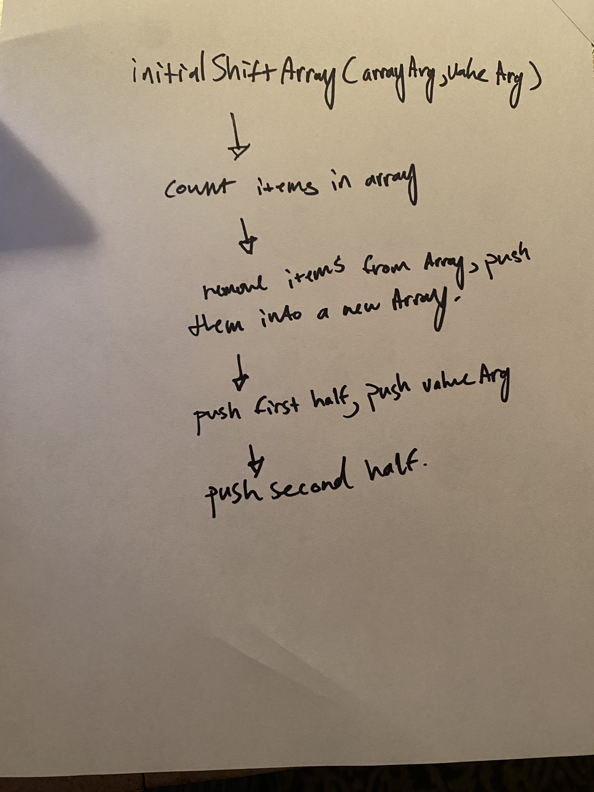

# array-insert-shift

Insert and shift an array in middle at index

## Whiteboard Process

## Approach & Efficiency
Worked backwards. I figured out what I needed to do. I went ahead and worked backwards, bit by bit without using any built in functions.

## Solution
See the Whiteboard Process
