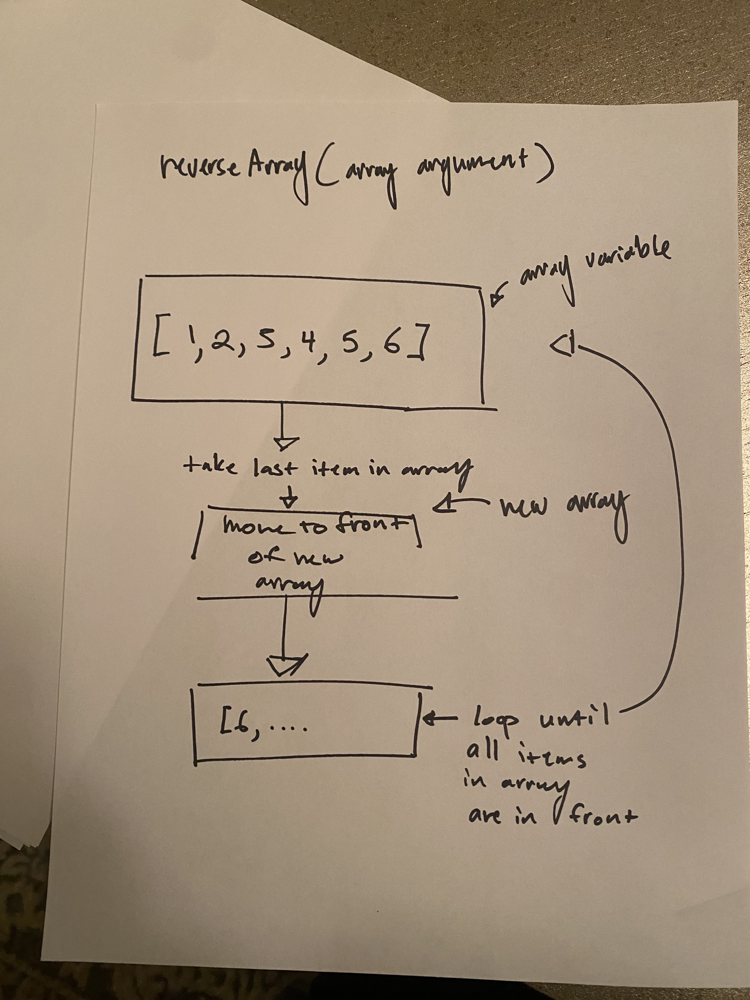

# Challenge Title
Write a function called reverseArray which takes an array as an argument. Without utilizing any of the built-in methods available to your language, return an array with elements in reversed order.

## Whiteboard Process

## Approach & Efficiency
I started with what the solution was; I worked backwards. How could I get the array to work. As I constructed my solution on the whiteboard, I realized I had a workable solution.

## Solution
See the Whiteboard Process
